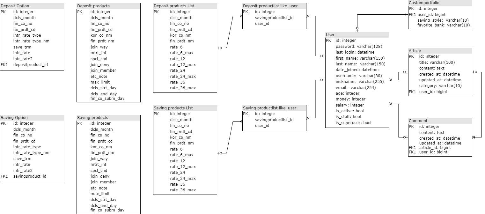
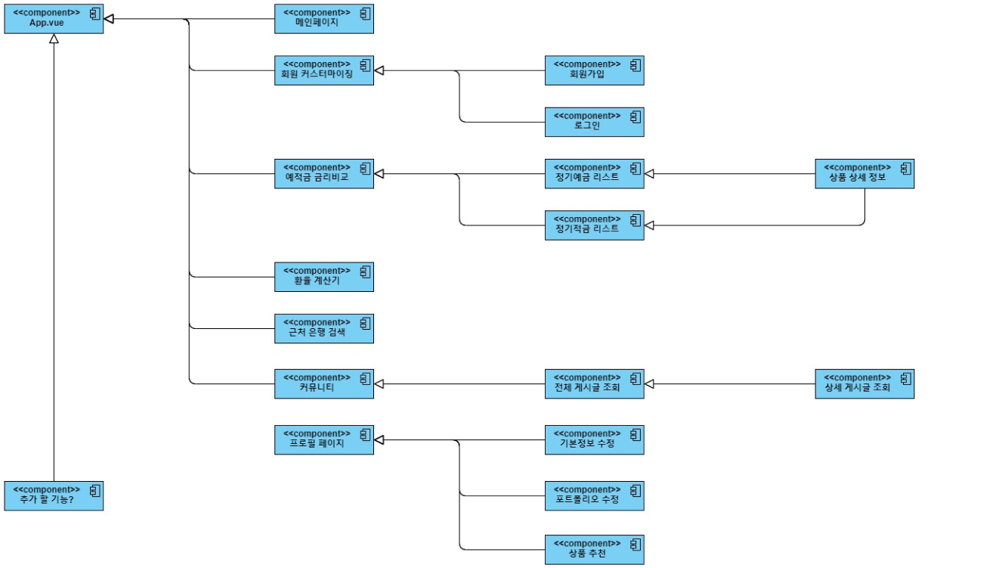

# 요약

👩‍💻 <b>개발 기간</b> : 2023.11.16 ~ 2023.11.23

🛠️ <b>프로젝트명</b> : SSAFY 10기 1학기 관통 프로젝트 '금융 상품 비교 애플리케이션' 제작

🖱️ 개발일정

11월 13일

- 팀명, 서비스명, 대표색상, 추천알고리즘 구상
- 필요 API 키 발급(금융감독원, 한국수출입은행, 카카오맵)

11월 14일

- 서비스명 'banksailor' 확정
- 대표 색상 위주로 피그마 작성

11월 15일

- 컴포넌트, view 구조 구상

11월 16일

- 금융비교, 환율, 카카오맵, 게시판 별로 역할 분담
- 17일까지 백엔드 완성 목표

11월 17일

- 금융 비교: 윤동휘
- 환율, 카카오맵: 김승희
- 게시판: 김현지

11월 18일~19일 주말

- 유저모델
- 프로필 페이지
- 앱 로고 제작

11월 20일

11월 21일

#### 👪 팀원

- 김승희 (팀장) - Back-End, Front-End
- 김현지 - Back-End, Front-End
- 윤동휘 - Back-End, Front-End

# 프로젝트 소개

## 서비스 소개

'BankSailor'

"당신만의 금융 항해사, BankSailor와 함께라면 저축이 더 쉬워집니다."

금전을 관리하는 여정은 넓은 바다를 항해하는 것과도 같습니다. BankSailor는 당신만의 안내자로서 여러분의 미래를 설계합니다. 함께 여행하며 안전한 항해를 경험해보세요.

## 화면 구성

## 주요 기능

예/적금별 금리 비교 제공

환율계산

주변 은행 검색

자유게시판

이용자 맞춤형 상품 추천 제공

# Technologies Used : 사용한 기술과 라이브러리

## 💻 기술 스택

Frontend
Vue3

Backend
Django 3.1.2
TensorFlow와의 결합을 용이하게 하기 위하여 프레임워크로 Django를 채택하였습니다.

## 피그마 초안

## ERD

## 컴포넌트 구조

# Deployment : 배포 링크

# Installation : 프로젝트 설치 및 실행 방법

https://www.openads.co.kr/content/contentDetail?contsId=8359
https://www.tensorflow.org/recommenders/examples/basic_retrieval?hl=ko
